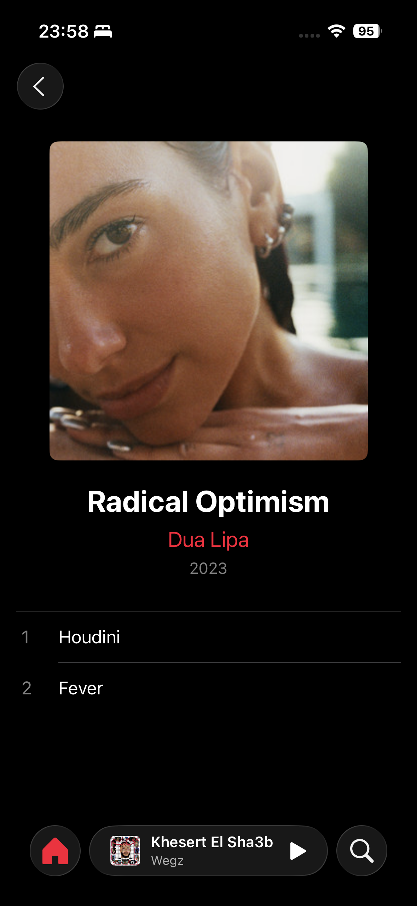
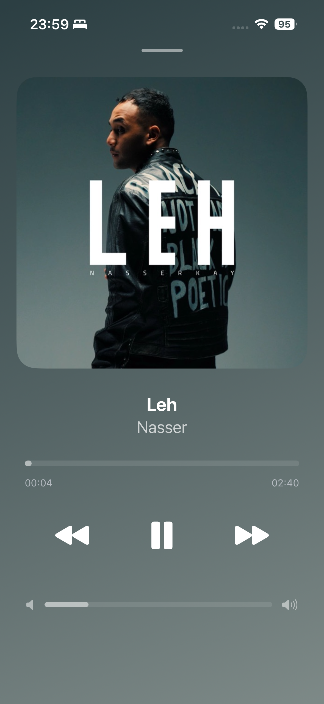

# 🎵 Leyl - Apple Music Recreation

<div align="center">

**A pixel-perfect recreation of Apple Music, built to master advanced iOS development**


*An Apple Academy project focused on mastering SwiftUI navigation, AVFoundation, and Live Activities*

[Features](#-features) • [Demo](#-demo) • [Technical Goals](#-technical-learning-goals) • [Architecture](#-architecture) • [Installation](#-installation)

</div>

---

## 📱 About The Project

Leyl (ليل - meaning "night" in Arabic) is a complete recreation of Apple Music's iOS app, built from the ground up using modern SwiftUI and iOS 26 features. This project was created as part of the Apple Developer Academy to explore three specific technical challenges in iOS development.

### 🎯 Technical Learning Goals

This project focuses on mastering three core areas:

1. **🎨 Advanced Navigation Transitions**
   - Custom gesture-based navigation
   - Spring animations and natural feel
   - Zoom transitions between views
   - Modal presentations with drag-to-dismiss

2. **🎧 AVFoundation Mastery**
   - Audio playback engine from scratch
   - Real-time progress tracking
   - Playlist queue management
   - Smooth scrubbing without interruption
   - Automatic next track playback

3. **🌟 Live Activities & Dynamic Island**
   - Always-on music controls
   - Real-time state synchronization
   - Interactive App Intents
   - Dynamic Island integration
   - Lock screen and StandBy mode support

---

## 🎬 Demo

### App Flow
> *Watch the complete user experience from browsing to playback*

**Key Interactions Demonstrated:**
- Browse albums with smooth scrolling
- Push navigation to album detail
- Tap song to start playback
- Mini player appears at bottom with smooth animation
- Tap mini player to expand full screen
- Custom drag-to-dismiss gesture
- Live Activity appears in Dynamic Island
- Control playback from lock screen

### Screenshots

<div align="center">

| Home Screen | Album View | Now Playing |
|:---:|:---:|:---:|
|  |  |  |

| Mini Player | Dynamic Island | Lock Screen |
|:---:|:---:|:---:|
|  |  |  |

</div>

---

## ✨ Features

### 🎵 Music Playback
- ✅ Play, pause, skip forward/backward
- ✅ Real-time progress tracking (10 updates/second)
- ✅ Smooth scrubbing during playback
- ✅ Automatic next track
- ✅ Playlist queue management
- ✅ Dynamic waveform visualization

### 🎨 User Interface
- ✅ Pixel-perfect Apple Music recreation
- ✅ Custom gradient backgrounds per album
- ✅ Animated album artwork (scales with playback state)
- ✅ Tab bar with custom icons
- ✅ Mini player with smooth transitions
- ✅ Full-screen now playing view

### 🔄 Navigation & Gestures
- ✅ Standard push navigation for albums
- ✅ Custom modal presentation for now playing
- ✅ Drag-to-dismiss with dynamic threshold (30% of screen)
- ✅ Spring animations for natural feel
- ✅ Zoom transitions with gesture support
- ✅ Edge pan and pinch-to-dismiss options

### 🌟 Live Activity & Dynamic Island
- ✅ Real-time playback info in Dynamic Island
- ✅ Interactive controls (play, pause, skip)
- ✅ Lock screen integration
- ✅ StandBy mode support
- ✅ Battery-efficient updates (throttled to 0.5s)

### 🎯 Additional Features
- ✅ Multiple albums and artists
- ✅ Recently played section
- ✅ Album grid view
- ✅ Search functionality
- ✅ Library organization
- ✅ Custom color schemes per album

---

## 🏗️ Architecture

### Design Pattern

The app follows **modern SwiftUI architecture** using `@Observable` for reactive state management:

```
┌─────────────────────────────────────────┐
│         SwiftUI Views Layer             │
│  (HomeView, AlbumView, SongView, etc.)  │
└─────────────────┬───────────────────────┘
                  │
┌─────────────────▼───────────────────────┐
│      AudioPlayerManager                 │
│   (@Observable - Single Source of Truth)│
│  • Manages AVPlayer lifecycle           │
│  • Tracks playback state                │
│  • Handles playlist queue               │
│  • Syncs with Live Activity             │
└─────────────────┬───────────────────────┘
                  │
┌─────────────────▼───────────────────────┐
│     System Frameworks Layer             │
│  • AVFoundation (Audio Playback)        │
│  • ActivityKit (Live Activities)        │
│  • App Intents (Interactive Controls)   │
└─────────────────────────────────────────┘
```

### Key Components

#### 1. **AudioPlayerManager** (`AudioPlayerManager.swift`)
The heart of the app - a singleton observable class that manages all audio operations:

```swift
@MainActor
@Observable
final class AudioPlayerManager {
    // MARK: - Core Properties
    private var player: AVPlayer?
    var songs: [Song] = []
    var currentSong: Song?
    var isPlaying = false
    var currentSongTime: Double = 0.0
    var currentSongDuration: Double = 0.0
    
    // MARK: - Key Features
    // ✓ Play/pause/skip functionality
    // ✓ Real-time progress tracking
    // ✓ Playlist queue management
    // ✓ Live Activity integration
    // ✓ Automatic next track
    // ✓ Smooth scrubbing
}
```

**Key Implementation Details:**
- Uses `addPeriodicTimeObserver` for 10x/second updates
- Manages memory with proper observer cleanup
- Throttles Live Activity updates to 0.5s for battery efficiency
- Handles audio session configuration for background playback

#### 2. **SongView** (`Views/SongView.swift`)
Full-screen now playing view with custom gestures:

```swift
.gesture(
    DragGesture()
        .onChanged { value in
            if value.translation.height > 0 {
                dragOffset = value.translation.height
            }
        }
        .onEnded { value in
            if value.translation.height > dismissThreshold {
                withAnimation(.spring(response: 0.4, dampingFraction: 0.8)) {
                    showSongView = false
                }
            }
            dragOffset = 0
        }
)
```

**Features:**
- Dynamic dismiss threshold (30% of screen height)
- Spring animation for organic feel
- Gradient background with animation
- Album artwork scaling based on playback state

#### 3. **Live Activity System**

**PlayingSongAttributes** (`Shared/PlayingSongAttributes.swift`):
```swift
struct PlayingSongAttributes: ActivityAttributes {
    public struct ContentState: Codable, Hashable {
        var emoji: String
        var currentTime: Double
        var duration: Double
        var isPlaying: Bool
        var title: String
        var artist: String
        var image: String
    }
    var song: Song  // Static attribute
}
```

**App Intents** for interactive controls:
- `TogglePlaybackIntent` - Play/pause
- `NextSongIntent` - Skip forward
- `PreviousSongIntent` - Skip backward
- `SeekSongIntent` - Scrub timeline

#### 4. **Custom Navigation Utilities**

**AllowedNavigationDismissalGestures** (`Utilities/AllowedNavigationDismissalGesture.swift`):
```swift
public struct AllowedNavigationDismissalGestures: OptionSet {
    public static let swipeToGoBack
    public static let zoomEdgePanToDismiss
    public static let zoomSwipeDownToDismiss
    public static let zoomPinchToDismiss
}
```

Allows fine-grained control over navigation gestures per view.

---

## 🛠️ Technical Stack

### Frameworks & APIs
- **SwiftUI** - Modern declarative UI framework
- **AVFoundation** - Audio playback and media handling
- **ActivityKit** - Live Activities and Dynamic Island
- **App Intents** - Interactive controls for Live Activities
- **Combine** - Reactive programming (minimal usage)

### Modern Swift Features
- `@Observable` macro (iOS 17+) instead of `@ObservableObject`
- `async/await` for asynchronous operations
- `.task` modifier for lifecycle-aware async work
- Property wrappers (`@State`, `@Binding`, `@Environment`)
- Swift 6 ready with proper concurrency handling

### Design Patterns
- **Single Source of Truth** - AudioPlayerManager
- **Unidirectional Data Flow** - State flows down, actions flow up
- **Composition over Inheritance** - Small, focused views
- **Native SwiftUI** - No UIKit wrappers or representatives

---

## 🚀 Installation

### Prerequisites
- **Xcode 15.0+**
- **iOS 18.0+** (for Dynamic Island features)
- **macOS Sonoma** or later
- **iPhone 15 Pro** or later (for Dynamic Island testing)

### Setup Steps

1. **Clone the repository**
```bash
git clone https://github.com/yourusername/leyl.git
cd leyl
```

2. **Open in Xcode**
```bash
open Leyl.xcodeproj
```

3. **Configure Signing**
- Select the `Leyl` target
- Go to "Signing & Capabilities"
- Select your development team
- Repeat for `PlayingSong` extension target

4. **Add Audio Files** (if needed)
- The project includes sample MP3 files in `Leyl/Songs/`
- To add your own: drag MP3 files to the Songs folder
- Update `AudioPlayerManager.loadSongs()` accordingly

5. **Build and Run**
- Select iPhone 15 Pro simulator or device
- Press `Cmd + R` to build and run
- For Dynamic Island: use physical iPhone 15 Pro/Max or iPhone 16 Pro/Max

### Targets
The project includes two targets:
- **Leyl** (main app)
- **PlayingSongExtension** (Live Activity extension)

Both must be built for full functionality.

---

## 💡 Key Technical Implementations

### 1. Smooth Drag-to-Dismiss Gesture

The drag-to-dismiss implementation uses a dynamic threshold and spring animation:

```swift
@State private var dragOffset: CGFloat = 0
@State private var dismissThreshold: CGFloat = 150

.offset(y: showSongView ? (dragOffset * 0.8) : 1000)
.animation(.spring(response: 0.4, dampingFraction: 0.8), value: dragOffset)
.gesture(
    DragGesture()
        .onChanged { value in
            if value.translation.height > 0 {
                dragOffset = value.translation.height
            }
        }
        .onEnded { value in
            if value.translation.height > dismissThreshold {
                withAnimation(.spring(response: 0.4, dampingFraction: 0.8)) {
                    showSongView = false
                }
            }
            dragOffset = 0
        }
)
.onAppear {
    dismissThreshold = geometry.size.height * 0.3
}
```

**Key Points:**
- Threshold is 30% of screen height for consistency across devices
- `dragOffset * 0.8` provides resistance feeling
- Only accepts downward drags (`translation.height > 0`)
- Spring animation values tuned for natural feel

### 2. Real-Time Audio Progress Tracking

AVFoundation time observers provide smooth progress updates:

```swift
private func addTimeObserver() {
    let interval = CMTime(seconds: 0.1, preferredTimescale: CMTimeScale(NSEC_PER_SEC))
    
    timeObserverToken = player?.addPeriodicTimeObserver(
        forInterval: interval, 
        queue: .main
    ) { [weak self] time in
        Task { @MainActor [weak self] in
            guard let self else { return }
            if !isEditing {
                self.currentSongTime = time.seconds
            }
        }
    }
}
```

**Important:**
- Updates every 0.1 seconds (10x per second)
- Respects `isEditing` state during scrubbing
- Proper cleanup in `deinit` prevents memory leaks
- Uses `@MainActor` for UI updates

### 3. Battery-Efficient Live Activity Updates

Live Activities are throttled to prevent excessive updates:

```swift
private var lastActivityUpdateDate: Date?

private func updateLiveActivityIfNeeded(force: Bool = false) {
    guard let activity = currentPlayingSongActivity else { return }
    
    let now = Date()
    if !force,
       let lastActivityUpdateDate,
       now.timeIntervalSince(lastActivityUpdateDate) < 0.5 {
        return  // Skip update if less than 0.5s since last
    }
    
    lastActivityUpdateDate = now
    let state = makeContentState()
    
    Task {
        await activity.update(ActivityContent(
            state: state, 
            staleDate: Date.now.addingTimeInterval(1.0)
        ))
    }
}
```

**Why This Matters:**
- Prevents battery drain from excessive updates
- Balances responsiveness with efficiency
- Force updates for critical state changes (play/pause/skip)
- Normal updates throttled to 2x per second

### 4. Custom Zoom Transitions

Using the `AllowedNavigationDismissalGestures` utility:

```swift
struct AlbumView: View {
    @State private var allowDismissalGesture: AllowedNavigationDismissalGestures = .none
    
    var body: some View {
        ScrollView {
            // Album content
        }
        .navigationAllowDismissalGestures(allowDismissalGesture)
        .task {
            // Delay enabling gestures to prevent accidental dismissal
            try? await Task.sleep(for: .seconds(1))
            allowDismissalGesture = .all
        }
    }
}
```

**Features:**
- Prevents accidental dismissal during navigation animation
- Supports edge pan, swipe down, and pinch gestures
- Can be customized per view
- Works with NavigationStack zoom transitions

---

## 🎓 Challenges & Learnings

### Challenge 1: Gesture Tuning
**Problem:** The drag-to-dismiss felt either too sensitive or too rigid.

**Solution:** After many iterations, I discovered:
- Threshold should be **percentage-based** (30% of screen height), not fixed pixels
- Adding resistance (`dragOffset * 0.8`) makes it feel more natural
- Spring animation parameters matter: `response: 0.4, dampingFraction: 0.8` feels right

### Challenge 2: AVFoundation Memory Management
**Problem:** Time observers were causing memory leaks and crashes.

**Solution:**
- Store observer tokens and remove them properly
- Use `[weak self]` in all closures
- Remove observers in `deinit` AND when setting up new players
- Use `@MainActor` to ensure UI updates on main thread

### Challenge 3: Live Activity State Sync
**Problem:** Live Activity would show stale data or update too frequently.

**Solution:**
- Throttle updates to 0.5 seconds minimum
- Force update for critical state changes (play/pause/skip)
- Handle scrubbing separately to avoid conflicts
- Clear all activities on app launch to prevent orphaned activities

### Challenge 4: Smooth Scrubbing
**Problem:** Scrubbing the timeline caused audio stuttering.

**Solution:**
```swift
func completeScrubbing(at time: Double) {
    currentSongTime = time
    let targetTime = CMTime(seconds: time, preferredTimescale: CMTimeScale(NSEC_PER_SEC))
    player.seek(to: targetTime, toleranceBefore: .zero, toleranceAfter: .zero)
}
```
- Use zero tolerance for precise seeking
- Update UI immediately, seek asynchronously
- Track scrubbing state to prevent observer conflicts

### Challenge 5: Dynamic Island Integration
**Problem:** Dynamic Island wouldn't update or show correctly.

**Solution:**
- Ensure ActivityKit capability is enabled
- Test on real device (simulator support limited)
- Provide compact and expanded presentations
- Use proper image assets for Dynamic Island size constraints

---

## 📚 Project Structure

```
Leyl/
├── Leyl/
│   ├── LeylApp.swift                    # App entry point
│   ├── Models/
│   │   ├── Song.swift                   # Song data model
│   │   ├── Album.swift                  # Album data model
│   │   └── ...
│   ├── Services/
│   │   └── AudioPlayerManager.swift     # Core audio engine
│   ├── Views/
│   │   ├── MainTabView.swift           # Root tab view
│   │   ├── HomeView.swift              # Home screen
│   │   ├── AlbumView.swift             # Album detail
│   │   ├── SongView.swift              # Now playing (full screen)
│   │   └── Components/
│   │       ├── MusicPlaybackView.swift # Mini player
│   │       ├── SongPlayerView.swift    # Playback controls
│   │       └── ...
│   ├── Utilities/
│   │   ├── AllowedNavigationDismissalGesture.swift
│   │   ├── Color+Hex.swift             # Hex color support
│   │   └── ...
│   ├── Assets.xcassets/                # Images and colors
│   └── Songs/                          # MP3 audio files
├── PlayingSong/                        # Live Activity extension
│   ├── PlayingSongLiveActivity.swift   # Activity configuration
│   ├── SongLiveActivityView.swift      # Dynamic Island UI
│   └── AppIntent.swift                 # Interactive controls
├── Shared/
│   ├── PlayingSongAttributes.swift     # Activity data model
│   └── SongPlaybackIntents.swift       # App Intent definitions
└── README.md
```

---

## 🎯 Key Features Breakdown

### Home Screen
- Tab-based navigation with 5 tabs
- Recently played grid
- Album collection
- Custom tab bar icons
- Smooth scrolling with parallax effects

### Album View
- Album artwork and metadata
- Song list with track numbers
- Visual indication of currently playing song
- Animated waveform for active track
- Push navigation from home

### Now Playing (SongView)
- Full-screen modal presentation
- Dynamic gradient background
- Animated album artwork
- Real-time progress bar
- Play/pause/skip controls
- Volume control
- Custom drag-to-dismiss gesture
- Seamless animation from mini player

### Mini Player
- Always visible when song is playing
- Shows current song artwork, title, artist
- Play/pause button
- Tap to expand to full screen
- Smooth height animation with tab bar

### Live Activity
- Dynamic Island support
- Compact view: Song title + artwork
- Expanded view: Full controls + progress
- Lock screen widget
- Interactive buttons (play/pause/skip)
- Real-time progress updates
- Battery-efficient throttling

---

## 🔮 Future Enhancements

### Planned Features
- [ ] iCloud sync for library
- [ ] Apple Music API integration
- [ ] Lyrics support with time-sync
- [ ] Spatial Audio support
- [ ] AirPlay integration
- [ ] CarPlay support
- [ ] Widget (Home Screen & Lock Screen)
- [ ] Siri integration
- [ ] Custom EQ settings
- [ ] Playlist creation and management
- [ ] Search with advanced filters
- [ ] Share songs with friends
- [ ] Dark/Light theme toggle
- [ ] Haptic feedback improvements

### Technical Improvements
- [ ] Unit tests for AudioPlayerManager
- [ ] UI tests for critical flows
- [ ] Performance optimization for large libraries
- [ ] Accessibility improvements (VoiceOver, Dynamic Type)
- [ ] Localization support
- [ ] Background audio session handling
- [ ] Remote control events (headphone buttons)
- [ ] Audio interruption handling (calls, alarms)

---

## 🤝 Contributing

This is an educational project, but suggestions and feedback are welcome!

If you'd like to contribute:
1. Fork the repository
2. Create a feature branch (`git checkout -b feature/AmazingFeature`)
3. Commit your changes (`git commit -m 'Add some AmazingFeature'`)
4. Push to the branch (`git push origin feature/AmazingFeature`)
5. Open a Pull Request

---

## 📄 License

This project is created for educational purposes as part of the Apple Developer Academy program.

**Note:** Apple Music, Apple Music logo, and related trademarks are property of Apple Inc. This project is a recreation for learning purposes only and is not affiliated with or endorsed by Apple Inc.

---

## 👨‍💻 Author

**Abdelaziz Salah**
- Apple Developer Academy Student
- Project Timeline: November 2025
- Duration: 2 weeks

### Learning Goals Achieved ✅
- ✅ Mastered advanced SwiftUI navigation patterns
- ✅ Built production-quality audio player with AVFoundation
- ✅ Implemented Live Activities with Dynamic Island
- ✅ Learned proper state management with @Observable
- ✅ Created smooth, native-feeling animations
- ✅ Understood iOS system integration (ActivityKit, App Intents)

---

## 🙏 Acknowledgments

- **Apple Developer Academy** for the learning opportunity
- **Apple Music** for the design inspiration
- **Apple Developer Documentation** for comprehensive guides
- **Swift community** for best practices and patterns

---

## 📞 Contact & Links

- **GitHub**: [Your GitHub Profile]
- **LinkedIn**: [Your LinkedIn Profile]
- **Email**: [Your Email]

---

<div align="center">

**⭐ Star this repo if you found it helpful!**

Made with ❤️ and SwiftUI

</div>

